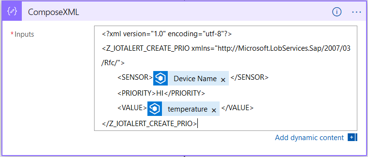
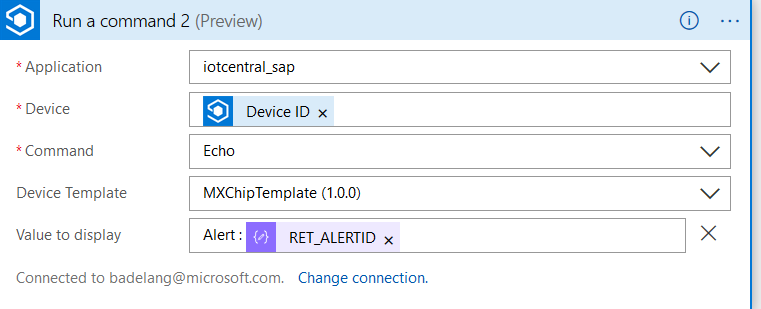

# Connect Azure IoT Cental with SAP

This document describes how you can connect Azure IoT Central with an SAP system using an Azure Logic App and the SAP Adapter.

The scenario looks as follows :
1. IoT Device sends temperature data to IoT Central.
2. IoT Central monitors the temperature via a Rule.
3. If the rule is triggered, eg. max Temperature > 20°C then a Logic App is started.
4. The Logic App uses the SAP Adapter to call a RFC which create an alert.
5. For fun the logic app sends a message to the IoT device containing the alert nr.

As IoT device I used the MXChip from the Microsoft Azure IoT Starter kit. 
For generic info on IoT Central, see [Azure IoT Central](https://azure.microsoft.com/en-us/services/iot-central/).
For generic info on the IoT Device, see [Azure IoT Developer Kit](https://microsoft.github.io/azure-iot-developer-kit/).

The first step is to create an IoT Central Application. Since we want to use a Logic App in the alert rules you need to use a Pay-As-You-Go payment plan for your IoT Central App. As application template I chose the Sample Contoso template. This template already contains the configurations to easily connect a MXChip.

To connect the IoT Device to your newly created IoT Central, please follow [Connect an MXChip IoT DevKit device to your Azure IoT Central application](https://docs.microsoft.com/en-us/azure/iot-central/howto-connect-devkit) .

Check if the measurements are coming in and check if you can use the echo command. This command will be used by the Logic App to display the AlertId.

Now it's time to setup the Telemetry Rule. This is done in the Device Template of the mxChip (MXChipTemplate). You can configure a telemetry rule using a condition like max(temperature) > 20°C (or other suitable value :) ).

You then need to create the Logic App itself. This is done in the azure portal. 
The trigger step of the Logic App should be a 'When a rule fired' from Azure IoT Central. In the configuration screen of this trigger, you create the link with your IoTCentral Application and telemetry rule. The Logic App will now also show up in the telemetry rule.


The output of the trigger contains info like deviceId, telemetry data, rule, ... .


This info can be used to fill the xml string needed by the SAP RFC Adapter. 



The SAP Adapter is used to call the Z_IOTALERT_CREATE_PRIO RFC. The ABAP code for this function module can be found in [sap_iot_abap](https://github.com/bdelangh/sap_iot_abap). You can use ABAPGit to retrieve the code into your test system.


Note: Before you can use the SAP adapter, you need to install the LogicApp 'on-premises' data gateway. See [Connect to SAP systems from Azure Logic Apps](https://docs.microsoft.com/en-us/azure/logic-apps/logic-apps-using-sap-connector).
To install the gateway, see [Connect to on-premises data sources from Azure Logic Apps](https://docs.microsoft.com/en-us/azure/logic-apps/logic-apps-gateway-connection). You'll also need the [SAP .NET Connector (NCo) library](https://support.sap.com/en/product/connectors/msnet.html). Since my SAP system is running on Azure I installed the Gateway on a seperate vm.

Since the RFC gives the alertId as output, we can send this info back to the IoT Device. Here we first need to convert the output of the 'Send Message to SAP' step into a json document and parse this json. 
First we convert the xml output to json. This can be done in a Compose action of the Data Operations section. Use the following code snippet in the input.

	`json(xml(body('Send_message_to_SAP')))`

The next step is to parse the JSON. Use a 'Parse JSON' action from the Data Operations section.

You use the following template :
```
{
    "properties": {
        "Z_IOTALERT_CREATE_PRIOResponse": {
            "properties": {
                "@@xmlns": {
                    "type": "string"
                },
                "RET_ALERTID": {
                    "type": "string"
                }
            },
            "type": "object"
        }
    },
    "type": "object"
}
```

This template can also be found on [AlertIdTemplate.json](https://github.com/bdelangh/SAP-IoT-Cental/blob/master/AlertIdTemplate.json).

To send a message to the IoT Device you'll need the action 'Run a command' of the Azure IoT Central object.
You'll need the deviceId and the alertid retrieved from the previous step.
Here you can use the echo command to display the value on the screen of the mxChip.



The setup is complete now. Have fun testing!

The complete logicApp can be found at [IoTCentral_CreateTempAlert.json](https://github.com/bdelangh/SAP-IoT-Cental/blob/master/IoTCentral_CreateTempAlert.json).
